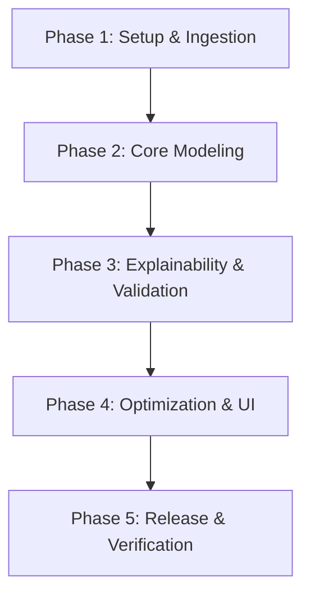

# FasalDacsaab — Project Development & Execution Plan

This document outlines the execution plan, milestones, and deliverables for the development of **FasalDacsaab**, an agritech crop disease diagnosis tool. The project is structured as a 5-week development lifecycle focusing on machine learning modeling, computer vision pipelines, visual interpretability, and web deployment.

---

## Development Roadmap & Milestones

The project lifecycle is divided into five weekly execution phases, followed by final integration and validation.



### Phase 1: Environment Setup, Ingestion, & Exploratory Data Analysis (Week 1)
**Goal:** Setup coding environment, build data ingestion pipeline, and analyze the dataset.
* **Environment Configuration:**
  - Initialize git repository.
  - Setup virtual environment (`venv` or `conda`) and dependencies (`requirements.txt`).
  - Create project directory structure (`/src`, `/data`, `/notebooks`, `/models`, `/docs`).
* **Data Ingestion:**
  - Build ingestion scripts to download and cache the PlantVillage leaf disease dataset.
  - Set up directory/dataloader paths for model training.
* **Exploratory Data Analysis (EDA):**
  - Analyze class distribution, image dimensions, and variance.
  - Document findings in `/notebooks/01_eda.ipynb`.

### Phase 2: Core Model Training & Fine-Tuning (Week 2)
**Goal:** Set up training loop, select backbone architecture, and establish baseline performance.
* **Data Augmentation:**
  - Configure data augmentation pipelines using `torchvision.transforms` or `albumentations` (flips, rotations, normalization, and color jitter).
* **Model Integration:**
  - Integrate a pretrained convolutional or transformer backbone (e.g., ResNet50 or EfficientNet) for transfer learning.
* **Training Pipeline:**
  - Implement a training script with standard split ratios (70% train, 15% val, 15% test).
  - Add early stopping based on validation loss and a learning rate scheduler.
  - Save checkpoint weights in `/models/checkpoints/`.

### Phase 3: Explainability Pipeline (Grad-CAM) & Deep Evaluation (Week 3)
**Goal:** Integrate visual explanation layers and perform intensive metric evaluation.
* **Explainability Integration:**
  - Implement Grad-CAM (Gradient-weighted Class Activation Mapping) on the final convolutional layer of the chosen backbone.
  - Build utility functions to generate heatmap overlays on test images.
* **Metric Suite:**
  - Compute per-class Precision, Recall, and F1-Scores on the test partition.
  - Generate and save a confusion matrix plot to evaluate model bias.
* **Error Analysis:**
  - Create script to extract and display the top-5 highest-loss (worst) misclassifications for qualitative review.

### Phase 4: Streamlit UI Integration & ONNX Optimization (Week 4)
**Goal:** Build a functional web application and serialize model weights for efficient inference.
* **Application Frontend:**
  - Build a Streamlit web application layout in `app.py`.
  - Add file uploader widget, image preview panel, and inference buttons.
  - Display class predictions with confidence percentages alongside the Grad-CAM activation overlay.
* **Model Serialization:**
  - Export PyTorch weights to ONNX (Open Neural Network Exchange) format.
  - Write benchmark comparison tests comparing PyTorch inference latency vs. ONNX Runtime inference latency.

### Phase 5: Production Deployment & System Verification (Week 5)
**Goal:** Deploy application publicly, perform full integration checks, and freeze release artifacts.
* **Cloud Deployment:**
  - Deploy the Streamlit app to a cloud platform (e.g., Streamlit Community Cloud, Hugging Face Spaces, or AWS EC2).
* **Documentation & Technical Artifacts:**
  - Finalize repository README detailing installation, setup, and usage.
  - Create and compile Architecture Decision Records (ADRs) under `/docs/adr/`.
  - Assemble a final Model Card specifying dataset details, training logs, and performance metrics.

---

## Architectural Decision Records (ADRs)
The project will document key technical trade-offs using ADRs in the following format:

```markdown
# ADR-XXX: [Title]

## Context
[Underlying problem statement and technical trade-offs]

## Decision
[Proposed technology choice or pattern]

## Consequences
[Positive and negative outcomes of the decision]

## Alternatives Considered
[Options evaluated and reasons for rejection]
```

At least three ADRs must be generated for the project:
1. **ADR-001:** Dataset choice and split methodology.
2. **ADR-002:** Architecture backbone choice (e.g., ResNet vs. EfficientNet vs. YOLO).
3. **ADR-003:** Deploy and serialization strategy (e.g., PyTorch native vs. ONNX Runtime).

---

## Verification Plan

### Automated Verification
* Run unit tests on image preprocessing pipelines and dataset loader logic.
* Run integrity validation checks to confirm ONNX output matching with original PyTorch outputs.

### Manual Verification
* Run user flow checks: upload test crop leaf images via the Streamlit interface and verify that:
  - Prediction class aligns with expectations.
  - Confidence bar charts render correctly.
  - Grad-CAM heatmap overlays highlighting infected areas render and align correctly.
