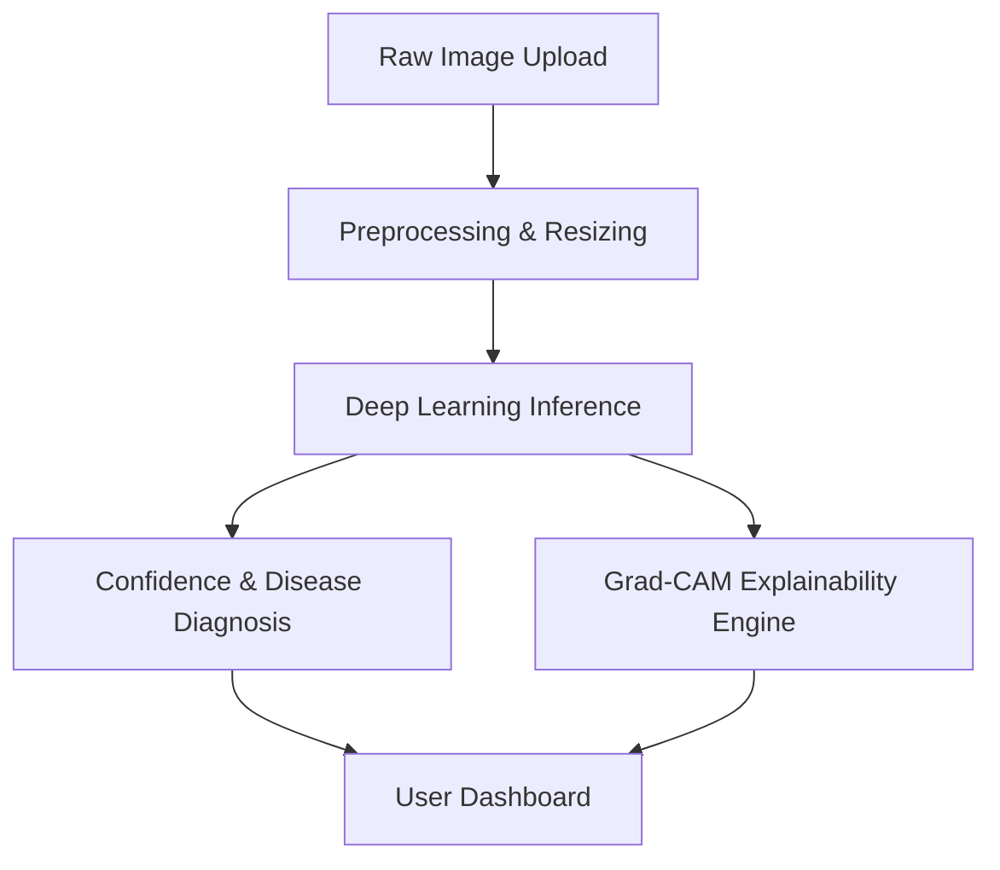

# FasalDacsaab — Detailed Project Objective

## 1. Project Background

Agriculture is the backbone of food security, yet plant diseases reduce global crop yields by an estimated 20% to 40% annually. Early detection of leaf diseases is crucial to mitigating these losses. **FasalDacsaab** is designed to leverage state-of-the-art computer vision models to diagnose crop leaf infections instantly from photos uploaded by farmers. 

The primary objective of FasalDacsaab is to deliver an end-to-end, explainable, and deployment-ready image classification and object detection system for crop leaf pathology, minimizing diagnosis delays and enabling precise crop protection strategies.

---

## 2. Core Features & Technical Requirements

### 1. Multi-Class Crop Disease Diagnostics
- **Target Dataset:** The system utilizes the **PlantVillage** dataset, comprising 54,303 healthy and diseased crop leaf images categorized into 38 distinct class labels (representing combinations of species like tomato, potato, apple, corn, grape, and specific diseases like bacterial spot, early blight, late blight, etc.).
- **Task Formulation:** Single-image classification mapping an input image $I$ to a probability distribution $P(C|I)$ over the 38 classes, or bounding-box regression and classification if choosing object detection.

### 2. Modern Transfer Learning Architectures
- **Model Backbone Selection:** Integrate and fine-tune convolutional networks (e.g., **ResNet50**, **EfficientNet-B0**) or object detection models (e.g., **YOLOv8**).
- **Training Strategy:** 
  - Freeze early layers to preserve low-level edge features.
  - Fine-tune higher-level layers using discriminative learning rates.
  - Implement Early Stopping based on validation loss, and Step/Cosine Annealing learning rate schedulers to prevent local optima.

### 3. Rigorous Evaluation Suite
- **Quantitative Metrics:** Profile per-class Precision, Recall, and F1-score. Target an overall classification accuracy of $>92\%$.
- **Error Diagnostics:** Construct normalized confusion matrices to isolate class confusion boundaries.
- **Worst-case Profiling:** Automatically compute and display the top-5 misclassified images with the highest classification loss to diagnose visual features causing confusion.

### 4. Explainable AI (XAI) Overlay
- **Algorithm:** **Grad-CAM** (Gradient-weighted Class Activation Mapping).
- **Implementation:** Backpropagate gradients of the target class score to the final convolutional layer of the backbone. Compute the weighted combination of forward activation maps to create a coarse localization heatmap.
- **Overlay Rendering:** Apply a jet-colormap heatmap overlaid onto the original leaf image, demonstrating visually that the model focuses on physical lesions and spots rather than background noise.

### 5. High-Performance Client UI & Serialization
- **Frontend App:** Clean **Streamlit** user interface featuring image upload drag-and-drop, classification results with confidence scores, and Grad-CAM side-by-side visualization.
- **ONNX Optimization:** Serialize model weights to ONNX format. Leverage ONNX Runtime for optimized CPU/GPU edge execution, comparing inference latency benchmarks against standard PyTorch runtimes.
