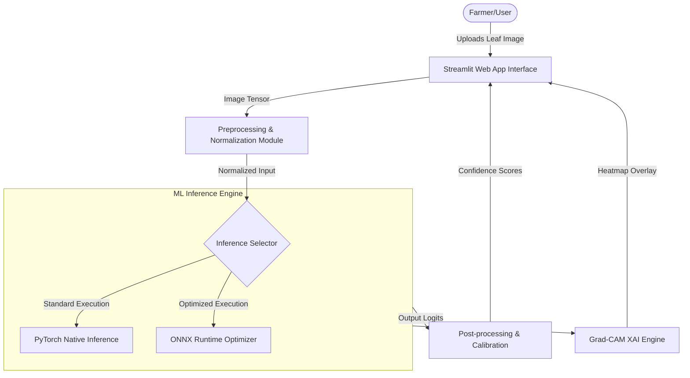

# FasalDacsaab — System Overview & Architecture

This document provides a comprehensive technical overview of the **FasalDacsaab** crop disease diagnostic system. It describes the design patterns, functional modules, and information flow across components.

---

## 1. System Architecture

FasalDacsaab is designed as a modular computer vision application. The architecture separates concerns between data processing, neural modeling, visual explainability, and the presentation layer.

---

## 2. Core Functional Modules

### A. Data Processing & Augmentation Module (`src/dataset.py`)
Responsible for loading images and mapping target category labels:
- **Preprocessing Pipeline:** Resizes input images to $224 \times 224$ pixels, converts them to tensors, and normalizes channels using mean $[0.485, 0.456, 0.406]$ and standard deviation $[0.229, 0.224, 0.225]$ to match ImageNet backbone expectations.
- **Augmentation (Training Only):** Applies random rotations ($\pm 15^\circ$), horizontal/vertical flips, and color jitter to expand dataset variance and prevent overfitting.

### B. Machine Learning Modeling Module (`src/models.py`)
Responsible for the core deep learning architecture:
- **Transfer Learning Backbone:** Incorporates a pretrained model (e.g., ResNet50 or EfficientNet) to leverage learned feature extractors.
- **Classification Head:** A customized fully-connected classifier with a dropout layer ($p=0.4$) to prevent co-adaptation, outputting log-probabilities over the 38 classes.

### C. Explainability Engine (`src/explain.py`)
Responsible for generating transparency maps:
- **Grad-CAM Implementation:** Registers a forward hook on the final convolutional layer of the backbone to record feature maps ($A^k$), and a backward hook to record gradients ($\frac{\partial Y^c}{\partial A^k}$) with respect to the target class $c$.
- **Importance Weights:** Calculates neuron importance weights $\alpha_k^c$ via global average pooling of gradients:
  $$\alpha_k^c = \frac{1}{Z} \sum_{i} \sum_{j} \frac{\partial Y^c}{\partial A_{i,j}^k}$$
- **Heatmap Generation:** Computes a weighted combination of forward activation maps and applies a ReLU function:
  $$L_{\text{Grad-CAM}}^c = \text{ReLU}\left(\sum_{k} \alpha_k^c A^k\right)$$
- **Overlay Builder:** Resizes the coarse heatmap to the original image dimensions, maps values to a Jet colormap, and blends it with the original RGB image using an alpha transparency of $0.5$.

### D. Inference Optimization Module (`models/`)
Responsible for packaging and maximizing inference performance:
- **ONNX Export:** Serializes the trained PyTorch model to the standard Open Neural Network Exchange format with a fixed input shape.
- **ONNX Runtime (ORT) Execution:** Executes inference using the highly-optimized C++ ORT backend, resulting in a significant reduction in CPU/GPU latency.

### E. User Interface Layer (`app.py`)
The presentation layer built with Streamlit:
- **Input Component:** A drag-and-drop file upload interface accepting PNG, JPG, and JPEG.
- **Processing Panel:** Triggers ONNX Runtime or PyTorch inference on the client image.
- **Visualization Panel:** Displays predicted class, confidence level (rendered as interactive bars), and side-by-side visualization of original image next to the Grad-CAM saliency overlay.

---

## 3. System Execution Flow

1. **Upload:** User uploads an image of a leaf.
2. **Preprocessing:** Streamlit app loads the image as a PIL object and passes it to the preprocessing pipeline, outputting a normalized tensor.
3. **Inference & Explanation:**
   - The tensor is evaluated by the serialized ONNX model to predict class logits.
   - Concurrently (or fallback to PyTorch), gradients are backpropagated to construct the Grad-CAM activation heatmap.
4. **Display:** The class logits are converted to softmax probabilities. The UI renders the top predictions alongside the jet-colored activation overlay.
